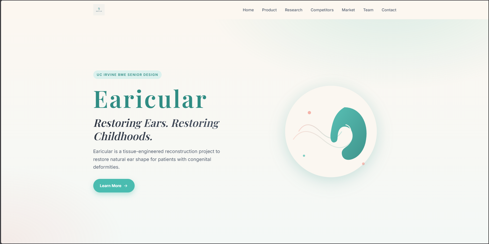

# Earicular — Auricular Reconstruction Capstone Website

Project website for a UC Irvine senior biomedical engineering capstone on auricular (external ear) reconstruction. Built and deployed solo.

<!-- TODO(jovan): add one screenshot of the live site here (the hero is the first thing a visitor sees).
     Capture earicular.uci.design, save it to assets/preview.png, and uncomment the line below. -->
<!--  -->

## Overview

This is the public-facing website for our senior capstone project on auricular reconstruction, presenting the team's research, design work, and findings. I designed, built, and deployed the entire site myself as part of the broader group project.

Live site: [earicular.uci.design](https://earicular.uci.design)

## My Role

- **Website:** I wrote all of the site code (HTML/CSS/JS) and handled deployment.
- **Biomechanical analysis:** I also developed the MATLAB analysis pipeline for the capstone's mechanical testing, converting raw Instron force-displacement data into engineering stress-strain curves and extracting mechanical properties (ultimate tensile strength, strain at failure, resilience, toughness, and Young's modulus by linear regression).

The research, experimental design, figures, and other technical work presented on the site were produced collaboratively by the full capstone team; my individual contributions are the two items above.

## Tech Stack

Plain HTML, CSS, and JavaScript, with no framework and no build step. The entire site is a single self-contained `index.html`: all styles live in one `<style>` block and all behavior in one `<script>` at the end of the file. The only external dependency is Google Fonts. Deployed via SFTP.

## Project Structure

```text
├─ index.html                        # entire site: HTML, inline CSS, inline JS
└─ website content/
   ├─ earicular-logo.png             # navbar + footer logo
   ├─ extearna.jpg                   # product photo (not used in current build)
   ├─ Website Content.pdf            # source reference material
   └─ website-photos/
      ├─ extearna/                   # product and lab testing photos
      ├─ gelma/
      │  ├─ bioink.gif               # animated bioink extrusion (used on site)
      │  ├─ bioinkcured.MOV          # raw clip (not used in current build)
      │  └─ bioinktesting.mov        # raw clip (not used in current build)
      └─ printing/                   # G-code and bioprinter photos
```

The site is one page with anchor-linked sections:

| Section | Anchor |
|---|---|
| Hero | `#home` |
| Product (Clinical Need, Extearna®, Solution) | `#product` |
| Research (GelMA, dECM, Surgery Problem, Approach) | `#research` |
| Competitor Analysis | `#competitors` |
| Market Strategy (overview + stakeholder tables) | `#market` |
| Team | `#team` |
| Contact | `#contact` |

## Running it Locally

Open `index.html` in a browser, or serve the folder with any static server (e.g. `python -m http.server`). All CSS and JS are inline, so there is nothing to build or install.

## Acknowledgments

Built as the website for the Earicular senior capstone team at UC Irvine. The project's research, experimental work, and figures were a group effort; this repository contains the website code I authored.
